# 2024Jan_Thailand__9

<html>
<head>

<meta charset="UTF-8">
<meta http-equiv="Content-Type" content="text/html; charset=UTF-8">
<meta http-equiv="X-UA-Compatible" content="IE=EmulateIE10" />
<meta http-equiv="X-UA-Compatible" content="IE=edge">

<!--ここから上はお決まりの定型文です-->

<!--ここからが表現の書式などを決めるcssという部分-->

<link href="https://cdnjs.cloudflare.com/ajax/libs/lightbox2/2.7.1/css/lightbox.css" rel="stylesheet">

</head>

<body>

モバイル端末をお使いの場合は、画面を横向きにすると
より見やすくご覧頂けます。

<!--ここ上は、ほぼそのまま使います！-->

<!--QRコードの挿入例-->

 アクセス用QRコード

<marquee direction="left" scrollamount="20" width="30%">(^_^)/~hada</marquee>

<!--流れ文字の挿入例-->
<h1><marquee behavior="left">!!! 2024/01/10 、チェンライでの日々 !!!</marquee></h1>

<a href="https://torokoid.github.io/2024Jan_Thailand/">Thailand</a>><a href="https://torokoid.github.io/2024Jan_Thailand_2/">Thailand_2</a>><a href="https://torokoid.github.io/2024Jan_Thailand_3/">Thailand_3</a>><a href="https://torokoid.github.io/2024Jan_Thailand__4/">Thailand__4</a>><a href="https://torokoid.github.io/2024Jan_Thailand__5/">Thailand__5</a>><a href="https://torokoid.github.io/2024Jan_Thailand__6/">Thailand__6</a>><a href="https://torokoid.github.io/2024Jan_Thailand__7/">Thailand__7</a>><a href="https://torokoid.github.io/2024Jan_Thailand__8/">Thailand__8</a>>Thailand__9><a href="https://torokoid.github.io/2024Jan_Thailand_10/">Thailand_10</a>

                 

<!--ここから下が、本体部分-->
 
タイ観光

<h2>10日はチェンライから北上、ラオス国境のメコン川流域を散策！</h2>
<h2>朝食は早々にすませます</h2>

<a href="20240110_003.JPG" data-lightbox="abc">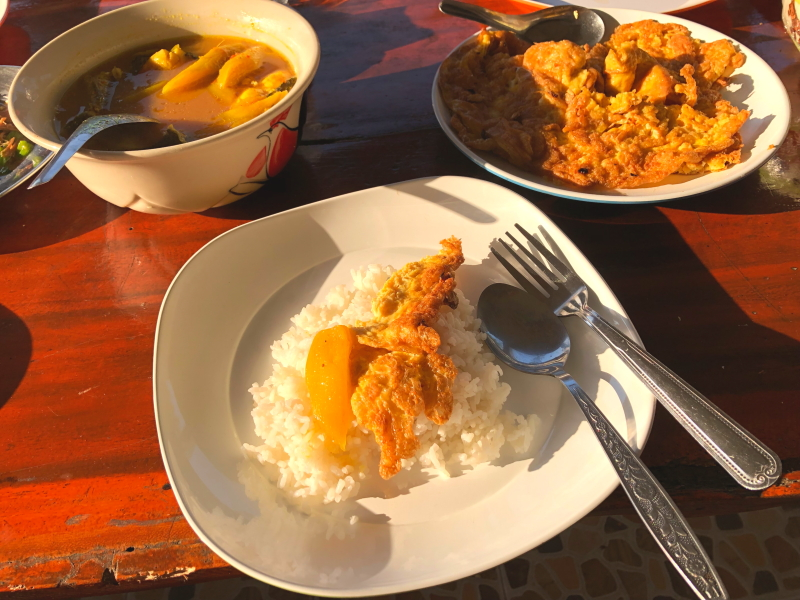</a>

<h2>近所のお寺の僧侶が朝から修行で歩きます</h2>

<a href="20240110_008.JPG" data-lightbox="abc">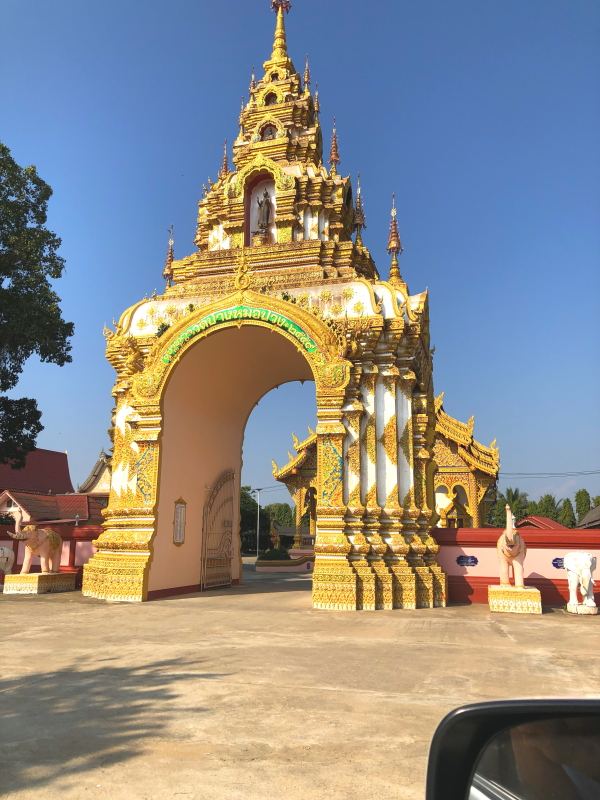</a>

<h2>地方の観光スポットは、この先に本当にあるの？みたいなところにあります</h2>

<h2>タイ北端、展望スポットに到着</h2>
<a href="20240110_018.JPG" data-lightbox="abc">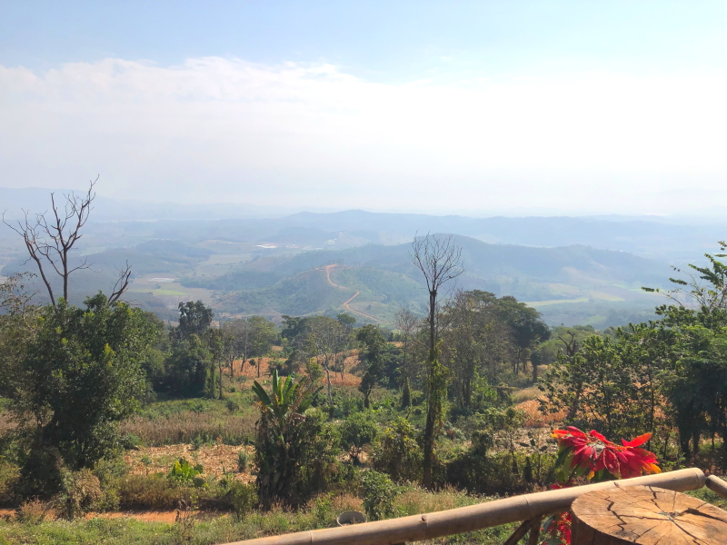</a>

<h2>白人さん、屋根に登っちゃいました</h2>
<a href="20240110_024.JPG" data-lightbox="abc">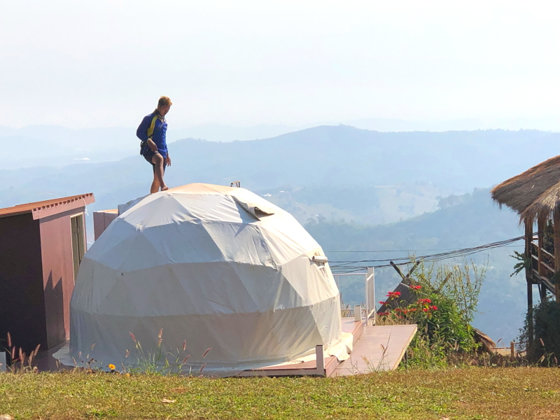</a>

<h2>完全に元はとったと思われるHondaのバイクはまだ稼働中</h2>

<a href="20240110_033.JPG" data-lightbox="abc">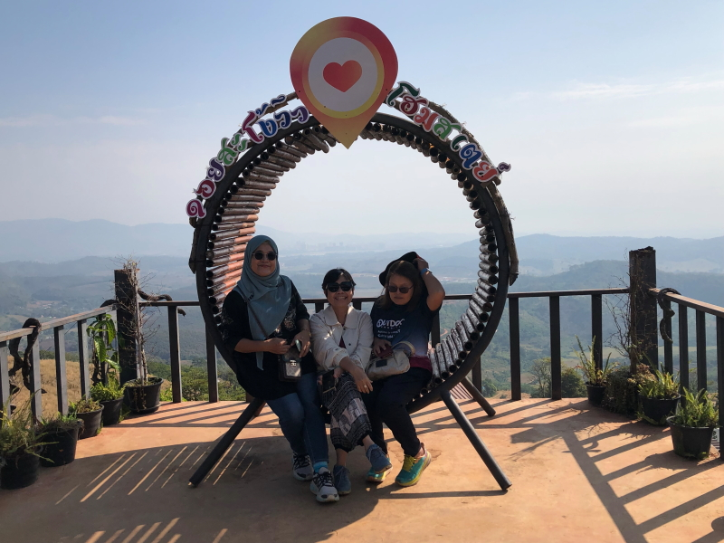</a>

<h2>メコン川の向こう、高層ビル群はラオスのカジノスポット</h2>

<h2>振り返るとタイの田園地帯</h2>

<a href="20240110_102.JPG" data-lightbox="abc">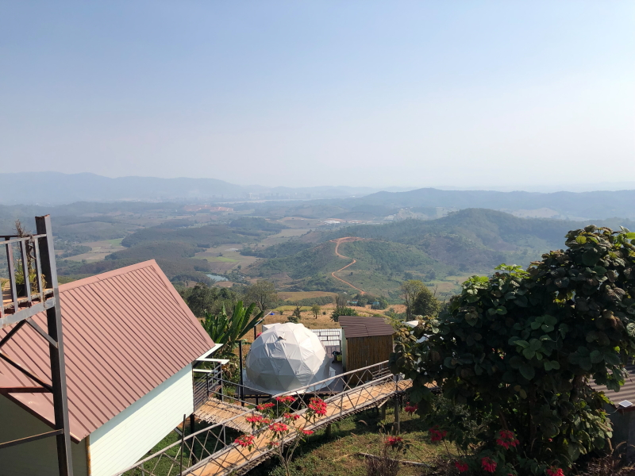</a>

<h2>山を降りてラオスのカジノエリア対岸に移動します</h2>

<h2>さらに移動します</h2>

<h2>仏教的リソースに注ぐエネルギーは、日本人の想像を遥かに超えています</h2>
<a href="20240110_052.JPG" data-lightbox="abc">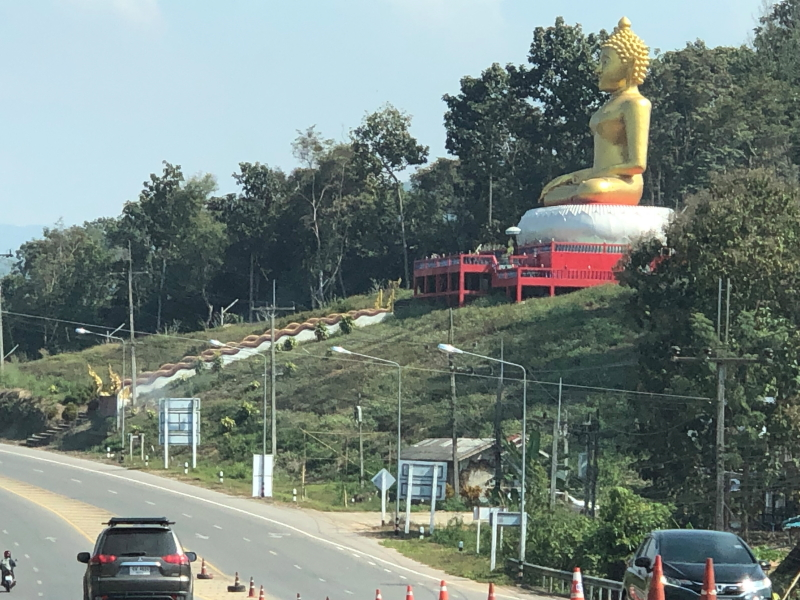</a>

<h2>移動に使った車と記念撮影</h2>

<h2>メコン川のほとりに到着、対岸はラオス</h2>

<a href="20240110_065.JPG" data-lightbox="abc">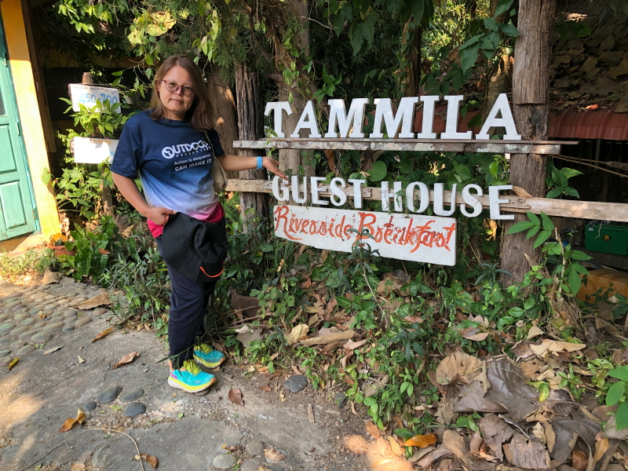</a>

<a href="20240110_068.JPG" data-lightbox="abc">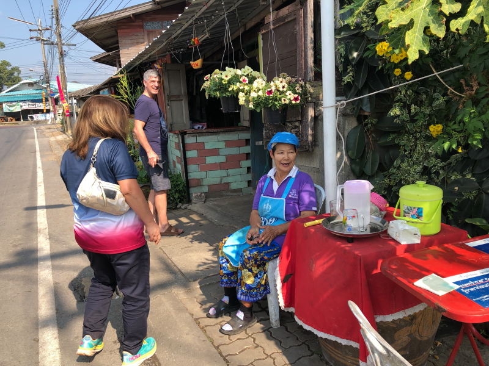</a>

<h2>海苔をごま油で揚げたおつまみが美味</h2>

<h2>9人分のお昼代は1460バーツ 約6000円 </h2>

<a href="20240110_074.JPG" data-lightbox="abc">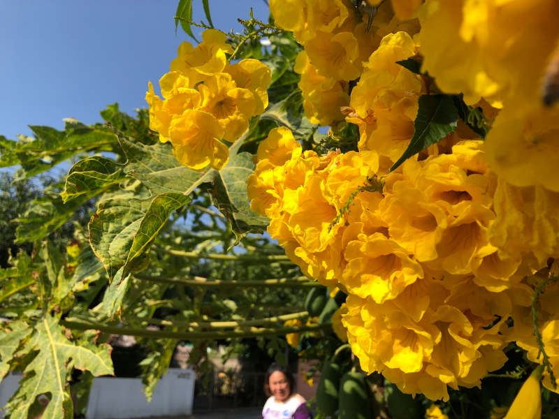</a>

<h2>中国資本がメコン川に橋をかけて、タイとラオス陸路で繋ぎました</h2>

<a href="20240110_088.JPG" data-lightbox="abc">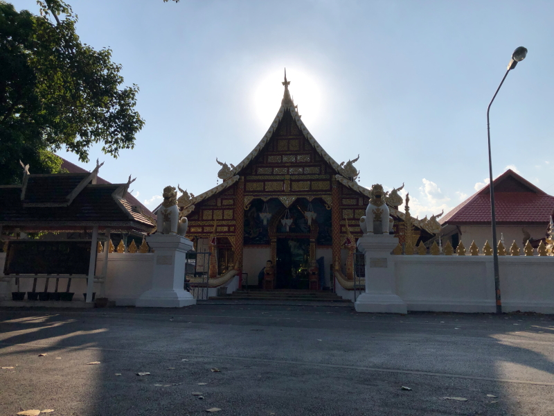</a>

<h2>最後は街の市場でお買い物</h2>

<h2>アジアンチックな食材が多数</h2>

<h2>どら焼きを購入</h2>

<h2>中身は全然違います</h2>

<h2>〆の食材調達は屋台</h2>

<h2>対岸のラオス側は夜が賑わってます</h2>

<!--
  
以下写真集！

1月2日はバンコクからパタヤまでお出かけしました。

-->

  

      

<!--本体はここまで-->

<!--画面に空白地帯を作って、背景が見えるようにしています-->
                                              

<!-- フッタ -->
<footer>

Copyright 2024/01/10 S.Hada

</footer>

<!--HPにさまざまなJavaScriptを呼び込むための書式-->

